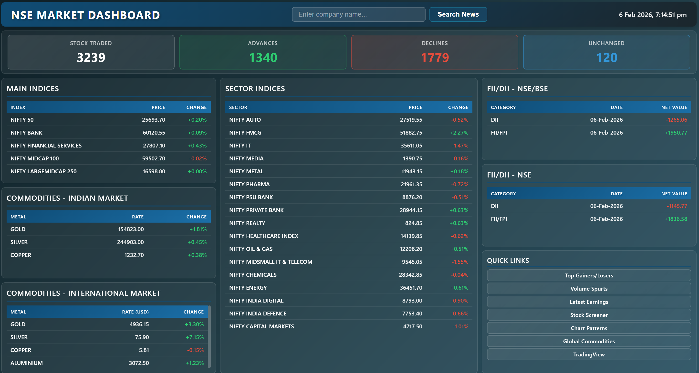

# NSE Market Dashboard

A real-time market dashboard for National Stock Exchange of India (NSE) displaying live market statistics, indices data, commodities, and FII/DII activity.



## Overview

This application provides a sleek, modern dark-themed interface to monitor NSE market data with lightning-fast automatic updates every 100 milliseconds. It features a comprehensive single-page layout with glass-morphism design, displaying market statistics, main indices, sector indices, commodities, and institutional trading activity.

## About This Project

This is a personal project developed entirely for my individual use and monitoring preferences. I have specifically selected and configured the indices, sectors, and commodities displayed on this dashboard based on my personal investment interests and market tracking requirements. The choice of which indices to include (such as NIFTY 50, NIFTY BANK, specific sector indices like Auto, FMCG, IT, Media, Metal, Pharma, Banking, Realty, Healthcare, Oil & Gas, Chemicals, Energy, Digital, Defence, Capital Markets, along with commodity prices for Gold, Silver, and Copper) reflects my own portfolio composition and areas of market interest that I wish to monitor in real-time.

This dashboard is not intended as a comprehensive market tracking tool for all available securities or indices, but rather as a customized solution tailored to my specific needs. The selection is purely based on personal preference and should not be interpreted as investment advice or a recommendation of these particular securities over others. I built this tool to streamline my daily market monitoring routine with the data points that matter most to me personally.

## Features

- **Real-time Market Statistics** - Live display of stocks traded, advances, declines, and unchanged stocks
- **Main Indices Tracking** - NIFTY 50, NIFTY BANK, Financial Services, MidCap, SmallCap, and LargeMidCap
- **Sector Indices** - 17 sector indices including Auto, FMCG, IT, Media, Metal, Pharma, Banking, Realty, Healthcare, Oil & Gas, Chemicals, Energy, Digital, Defence, and Capital Markets
- **Commodities Prices** - Live tracking of Gold, Silver, and Copper prices
- **FII/DII Activity** - Foreign and Domestic Institutional Investor trading data from both NSE/BSE and React India
- **Lightning Fast Updates** - Automatic data refresh every 100ms (0.1 seconds)
- **Modern UI/UX** - Dark gradient theme with glass-morphism effects and smooth transitions
- **Single Page Design** - All information visible at once with no scrolling required
- **Standalone Executable** - Packaged as NSE-Dashboard.exe for easy deployment

## Screenshots

The dashboard features a modern dark theme with:
- Gradient background (#0f2027 → #203a43 → #2c5364)
- Glass-morphism cards with blur effects
- Color-coded positive/negative values (green for gains, red for losses)
- Teal-themed table headers
- Responsive 3-column grid layout

## Prerequisites

- **For Running Executable**: None - just double-click NSE-Dashboard.exe
- **For Development**: Node.js (v18 or higher) and npm

## Installation & Usage

### Option 1: Standalone Executable (Recommended)

1. Simply run `NSE-Dashboard.exe`
2. The dashboard will automatically open in your default browser
3. Data starts updating immediately at 100ms intervals

### Option 2: Development Mode

1. Install dependencies:
   ```bash
   npm install
   ```

2. Start the server:
   ```bash
   npm start
   ```

3. Open your browser to `http://localhost:3000`

## Building Standalone Executable

To rebuild the standalone executable:

```bash
npx pkg app.js --target node18-win-x64 --output NSE-Dashboard.exe
```

## Project Structure

```
nse/
├── index.html              # Main HTML file with 3-column layout
├── styles.css              # Dark theme stylesheet with glass-morphism
├── script.js               # Client-side JavaScript (100ms updates)
├── app.js                  # Express server with auto-browser launch
├── server.js               # Alternative Express server
├── package.json            # Node.js dependencies
├── NSE-Dashboard.exe       # Standalone executable (~40MB)
├── icon.ico                # Application icon
└── README.md               # This file
```

## API Endpoints

The server provides the following proxy endpoints:

- `GET /api/market-stats` - Market statistics (stocks traded, advances, declines, unchanged)
- `GET /api/all-indices` - All NSE indices data (main + sector indices)
- `GET /api/metals` - Commodities data (Gold, Silver, Copper)
- `GET /api/fii-dii-react` - FII/DII trading data from React India
- `GET /api/fii-dii-nse` - FII/DII trading data from NSE

## Technical Details

- **Frontend**: HTML5, CSS3 Grid/Flexbox, Vanilla JavaScript
- **Backend**: Node.js, Express 4.18.2
- **Data Sources**: NSE India API, MoneyControl Commodities API
- **Update Frequency**: 100ms (10 updates per second)
- **Packaging**: pkg 5.8.1 for standalone executable
- **Auto-Launch**: open 8.4.0 for automatic browser opening
- **Design**: Dark gradient theme with glass-morphism effects
- **Performance**: Skip-if-fetching pattern prevents request pile-up

## Design Highlights

- **Dark Gradient Background**: Smooth transition from #0f2027 through #203a43 to #2c5364
- **Glass-morphism Cards**: Semi-transparent cards with backdrop blur (10px)
- **Color Coding**: Green (+) for gains, Red (-) for losses, Cyan for neutral values
- **Smooth Transitions**: Cubic-bezier animations for hover effects
- **Sticky Headers**: Table headers remain visible while scrolling within sections
- **Responsive Grid**: 3-column layout (1fr 1.2fr 1fr) adapts to content

## Performance

- **Update Rate**: 100ms (10 times per second)
- **Request Prevention**: isFetching flag prevents overlapping requests
- **Promise Handling**: Promise.allSettled() ensures all data loads independently
- **Silent Failures**: Errors don't disrupt the UI or stop updates
- **Efficient Updates**: Only cell values update, not entire table rows

## License

This project is for educational and personal use only. Market data is provided by NSE India and MoneyControl.
